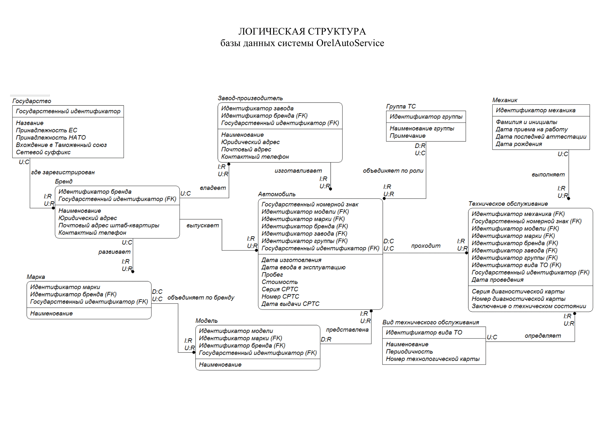
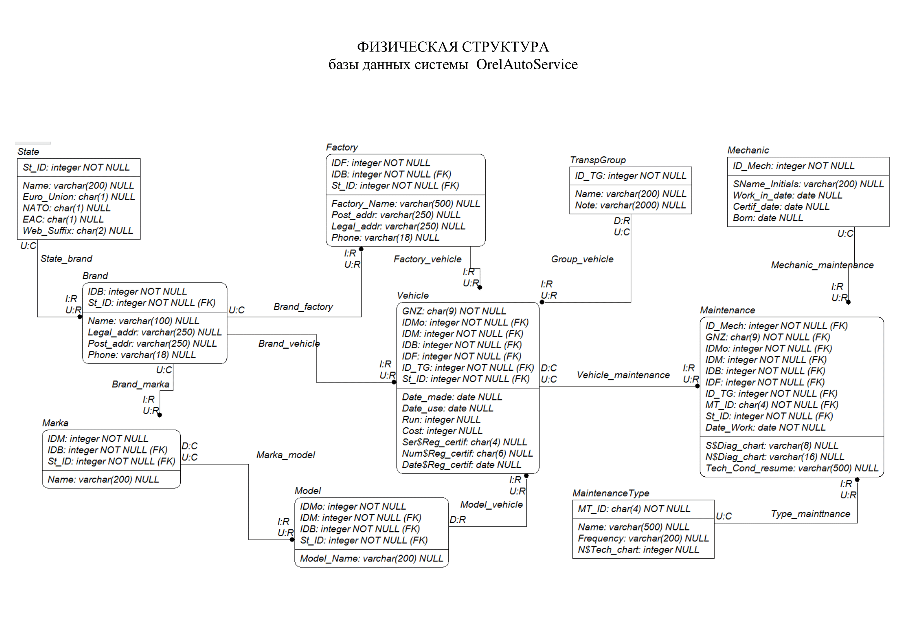

# Orel_auto

## Орел автосервис

### Логическая структура БД



### Физическая структура БД



### Переень задачь

<details><summary><strong>Простая выборка</strong></summary>

- Выдать список механиков.

```(SQL)
SELECT * FROM mechanic;
```

- Выдать государственные номерные знаки, серии, номера и даты выдачи
свидетельств о регистрации транспортных средств.

```(SQL)
SELECT gnz, ser$reg_certif, num$reg_certif, date$reg_certif FROM vehicle;
```

- Сформировать список автомобилей, прошедших обслуживание
(таблица maintenance), путем указания их государственных номерных
знаков (без дубликатов).

```(SQL)
SELECT DISTINCT gnz FROM maintenance;
```

- Выдать список государственных номерных знаков, серии, номера и
даты выдачи свидетельств о регистрации транспортных средств в виде
таблицы из двух колонок – "Государственный номерной знак",
"Свидетельство о регистрации транспортного средства".

```(SQL)
SELECT gnz "Государственный номерной знак", 
		concat_ws(' ,', 
        ser$reg_certif, 
		num$reg_certif, 
		date$reg_certif)
		"Свидетельство о регистрации транспортного средства"
FROM vehicle;
```

- Сформировать список автомобильных заводов с указанием
наименования, адреса фактического размещения и контактного
телефона. Перечень должен быть отсортирован по наименованию, по
алфавиту.

```(SQL)
SELECT factory_name, legal_addr, phone FROM factory
ORDER BY 1;
```

- Составить список групп транспортных средств (таблица transpgroup) в
формате <идентификатор группы>: <наименование группы> -
<описание> (колонки id_tg, name и note, соответственно).
Результирующий столбец должен быть именован, как "Группы
транспортных средств".

```(SQL)
SELECT concat(id_tg,': ', name,' - ', note) "Группа транспортных средств"
FROM transpgroup
```

- Составить список автомобилей с указанием их государственного
номерного знака, стоимости и уплаченной суммы налога на
добавленную стоимость, которая рассчитывается по ставке 20%. Если посчитать итоговую сумму налогов, то должно получиться 73 750 058 руб. 00 коп.

```(SQL)
SELECT gnz, cost, cost * 0.2 "НДС"
FROM vehicle;

SELECT SUM(cost * 0.2)
FROM vehicle;
```

- Рассчитать суммарную стоимость зарегистрированных автомобилей.
Результат представить в денежном формате (длина мантиссы равна 2).

```(SQL)
SELECT SUM(cost)::money 
FROM vehicle
```

- Выдать фамилии, инициалы и дату рождения механиков (получить в
результирующей выборке один столбец со значениями вида "Светлов
В.К., дата рождения 01.06.1967"). Для форматирования дат рождения
использовать маску dd.mm.yyyy. Дать столбцу альтернативное имя
"Лучшие механики предприятия". Ограничить список первыми пятью
механиками, сортировку не производить.

```(SQL)
SELECT concat(sname_initials, ' , дата рождения ', to_char(born, 'dd.mm.yyyy')) "Лучшие механики предприятия"
FROM mechanic
LIMIT 5;
```

- Выдать фамилии, инициалы, даты рождения в формате 'dd.mm.yyyy' и
возраст (в полных годах) механиков (использовать встроенную
функцию age для работы с интервалами дат; выражение вида
trunc((current_date-born)/365) некорректно, так как оно не
учитывает високосные года).

```(SQL)

```

- Рассчитать отношение стоимости каждого автомобиля к его пробегу в
километрах с точностью до копейки. Результат представить в виде:
"<государственный номерной знак>-<значение отношения стоимости к
пробегу> руб/км".

```(SQL)

```

- Сформировать список автомобилей (государственный номерной знак) с
указанием в отдельном столбце даты, а в отдельном столбце времени
прохождения обслуживания (таблица maintenance).

```(SQL)

```

- Сформировать ведомость амортизационной стоимости автомобилей,
учитывая, что за каждый полный год объект учета теряет 7%
первоначальной стоимости. Для автомобилей, амортизационная
стоимость которых меньше нуля, указывать отрицательную величину.
Возраст автомобиля считать от даты ввода в эксплуатацию – date_use
(таблица vehicle). В ведомость включить государственные номерные
знаки, дату ввода в эксплуатацию и остаточную стоимость.

```(SQL)

```

- Сформировать список автомобилей с указанием дня недели и
порядкового дня года, в который они выпущены (столбец date_made
таблицы vehicle). Результат оформить в виде одного столбца с именем
"День недели и день года выпуска".

```(SQL)

```

</details>
